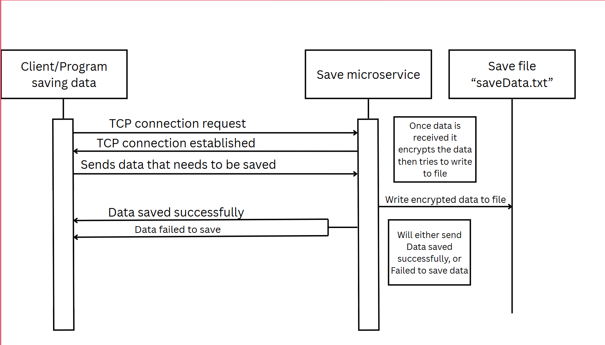

Microservice A: Encrypt and save data.

To request data to be encrypted and saved you must connect to tcp://localhost:5454. Ex: “(var requester = new RequestSocket(">tcp://localhost:5454")” This is only if the microservice is hosted locally. If it is not hosted locally then you must connect using the ip of the machine hosting the microservice. Ex: ">tcp://123.456.1.123:5454". Then data can be sent using “requester.SendFrame(Data);” or a similar TCP send. 

To receive the saved data it will be stored in one directory above the microservice in a file called saveData.txt. They can read this data by opening the file using any of the numerous ways to read files Ex: "open("saveData.txt", "r")". Additionally while in the TCP connection to receive data they must call “requester.ReceiveFrameString()” or a similar TCP receive. 

To use the microservice, there are two options: an executable located in the file MicroserviceAExecutable, or the microservice along with all of its code in MicroserviceACode.

With the executable you just download the entire file and click on MicroserviceA.exe. This will launch and have the microservice be running in the terminal. 

For the MicroserviceACode it works best if you open the MicroserviceA.sln with visual studio. When it launches you will then be able to modify any code in the microservice. To build and run the microservice you can do so by pressing the green arrow at the top of visual studio 

UML sequence diagram

